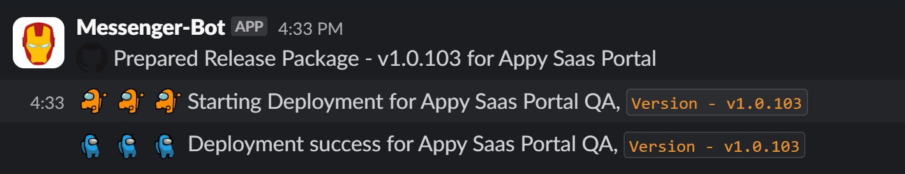
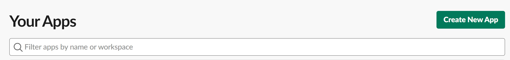
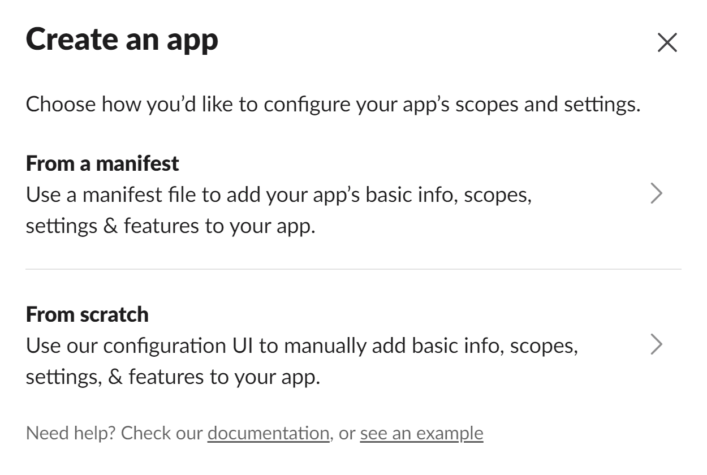
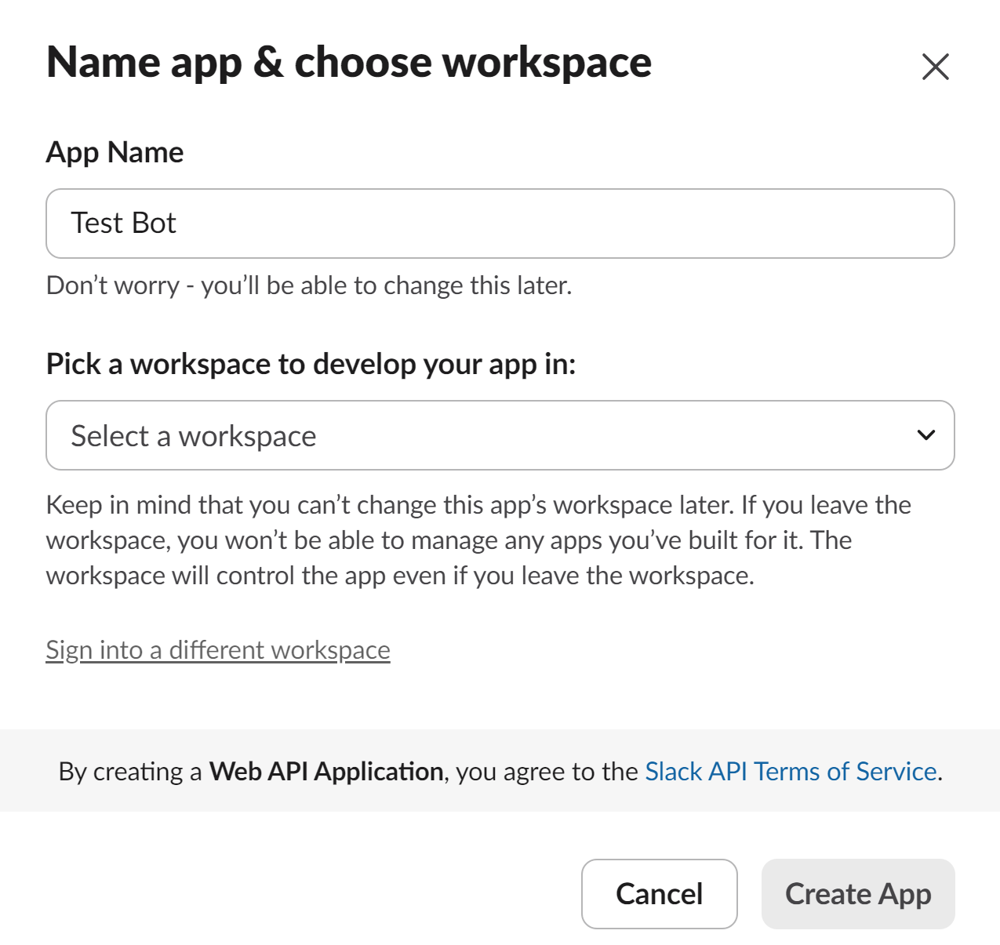
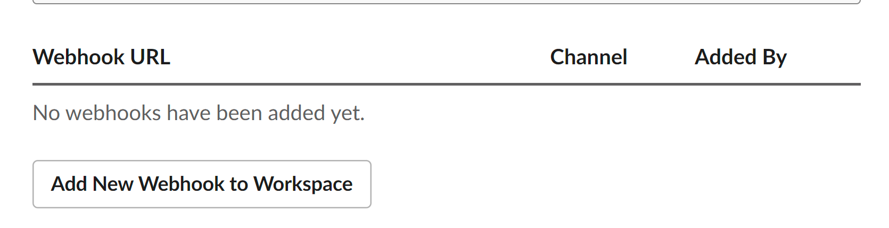
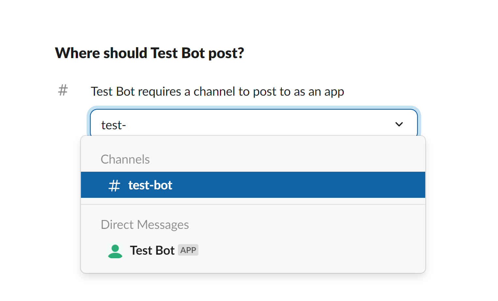
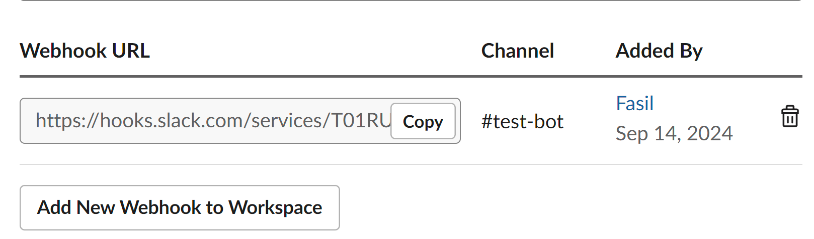
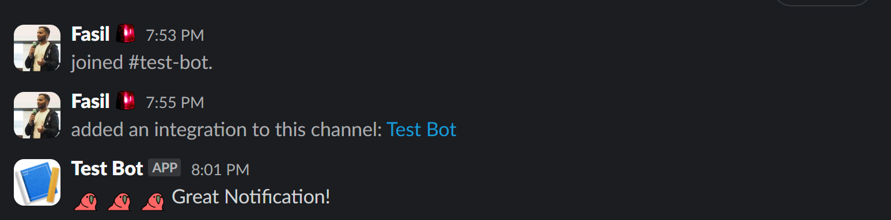

Ever felt like the official Slack documentation was written in hieroglyphics? You're not alone! After spending way too much time deciphering how to create a Slack bot and enable webhooks, I decided to put together this guide.

Why? Because getting real-time notifications in your Slack channel shouldn't be rocket science. Plus, my team and I use Slack for almost everything, so having those event notifications right where we chat is a game-changer.

So, let's cut through the noise and get you set up with a Slack bot in no time!




<br />


<br />

Let's dive into how we can create these awesome notifications!

Head over to the [Slack API](https://api.slack.com/apps). Once you're logged in, click on the `Create New App` button.



<br />

Click on `Create from scratch` to get started with your new Slack bot.



<br />

Give your app a catchy name, select the workspace where it will live, and hit `Create App`.



<br />

Now that we've created the app, let's set up a webhook to publish messages to a specific channel.

Click on `Incoming Webhooks` and toggle the `Activate Incoming Webhooks` switch. This will enable the `Add new webhook to workspace` button.



<br />

Heads up: If you're on Slack's free tier, you're limited to 10 apps per workspace. So, make sure you only install what's necessary.

Next, select the channel where your bot should post. I've created a channel called `#test-bot` for testing purposes.



<br />

Once you click on `Allow`, you'll be redirected back to the webhooks page where you'll see your shiny new webhook.



<br />

Now, let's test it out! Replace `<your awesome webhook>` in the curl command below with your actual webhook URL:

```curl
curl --location '<your awesome webhook>' \
--header 'Content-type: application/json' \
--header 'Cookie: b=5302b6a0d86156be293aae2e14ef0cd1' \
--data '{ "text": ":60fps_parrot: :60fps_parrot: :60fps_parrot: Great Notification!"}'
```

<br />
Make a curl request via terminal or from Postman, and voilà!



<br />

You can further customize how the bot looks in the app management page.

In my next blog, [Streamline App Monitoring with Seq](../seq-monitoring), I'll discuss how we leverage Slack for app monitoring.

Stay tuned!
