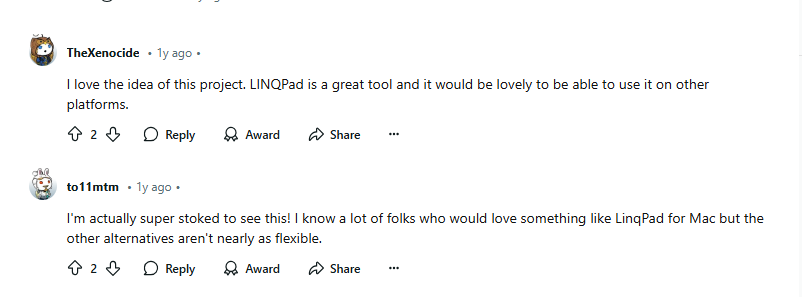
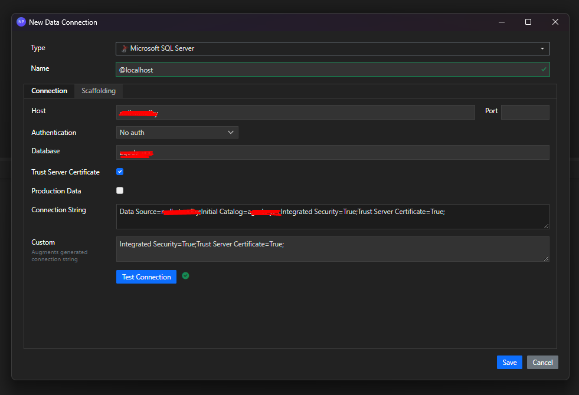

I have extesively used [LINQPad](https://www.linqpad.net/purchase.aspx) during my early days of learning C# and .Net. This nifty tool to run C# code snippets and see the output. Its a freemium product and it was fantastic to use. Fast forward a few years, and a colleague at Agoda reintroduced me to LINQPad. I was blown away by the new features and how much it had evolved. And guess what? We had access to the premium version! You can check out all the cool features of LINQPad [here](https://www.linqpad.net/purchase.aspx).

This blog isn't about LINQPad—we all know it's a fantastic tool. But here's the catch: to use LINQPad, you need a Windows machine. Our beloved .NET is cross-platform now, and many of our engineers are using Macs for .NET development. So, I went on the hunt for a tool that can run C# code snippets, and I found [NetPad](https://github.com/tareqimbasher/NetPad). Just to be clear, it's not a LINQPad alternative, but it can run C# code snippets and offers much more.

 
Kudos to the creator of NetPad, [Tareq](https://www.linkedin.com/in/tareq-imbasher/)! NetPad boasts a VS Code-like UI and supports one of LINQPad's premium features: [importing NuGet packages](https://www.linqpad.net/Purchase.aspx#NuGet). Plus, it has excellent IntelliSense support.

Let's explore a couple of amazing use cases for NetPad.

### Running Code Snippets with NuGet Packages

You can literally run any C# code snippet and see the output. Here, I'm trying to create a Kafka listener and check the output. You can add the NuGet package to the context by clicking on the wrench symbol or pressing the `F4` key. This opens the Package Manager window, where you can add NuGet packages. After that, it's business as usual: write your code and run it.

 
As you can see from the image below, I've added the NuGet package `Confluent.Kafka`, created a Kafka listener, and ran the code. The output is displayed in the output window.

 
Curious about what the `</>code` window does? It gives you the AST (Abstract Syntax Tree) of the code you've written. The AST provides the structure of your code, helping you understand how the IDE reads it. You can use this to create analyzers or code fixers.

 

### Connecting to a Database with Windows Authentication

You can also connect to a database and run queries. Here, I'm connecting to a SQL Server using Windows authentication. To support Windows auth, just add `Integrated Security=True;` to your custom connection string. The maintainer has agreed to include this option in the UI in the next release.

 
Once saved, it will take a few seconds to scaffold the database, and then you can run your queries. You can either right-click on the connection and select "Use in new script" or just select the connection from the script pane. Here's a basic query execution:

 
If you're a big fan of LINQPad's `.Dump()`, NetPad's version is pretty basic, but it gets the job done. For those curious about how LINQPad's dump works, check out the image below.

 
You see how it gives you nice formatting of relationship mapping? It's incredibly helpful for large databases. Hopefully, NetPad will include this feature in the next release.

NetPad also lets you visualize the SQL executed, which is pretty handy for understanding complex LINQ queries.

 

The ability to execute LINQ code while connected to a database is pretty cool. Whether you're patching the database for complex data fixes, producing ad-hoc Kafka events based on data during debugging, or any other use case you can imagine, it's incredibly useful.

NetPad is still in its early days and has a long way to go, but it's already a great tool to have in your toolkit.
