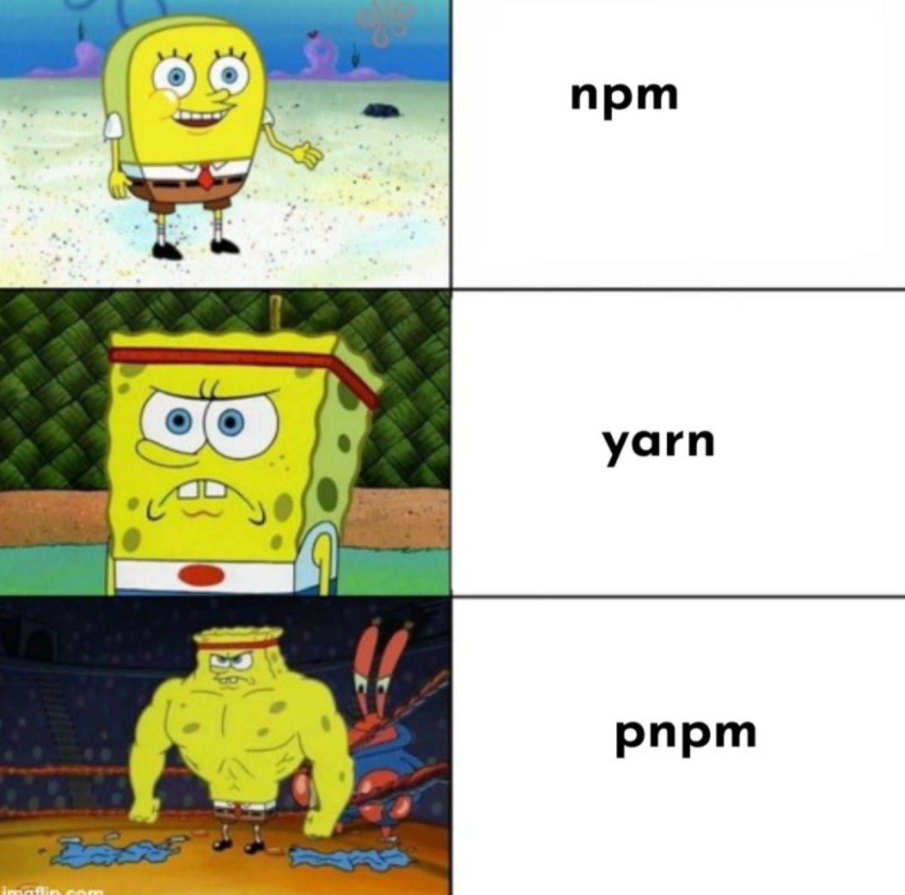
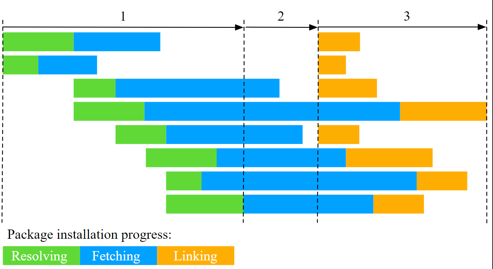

Node modules are my beloved feature in the JavaScript ecosystem. But they're also the most hated, thanks to their labyrinthine resolution process. Once upon a time, npm install was a coffee break affair, but as projects grew, it turned into a full-blown lunch break. Enter Yarn, our knight in shining armor! We adored Yarn's package resolution magic. Yet, even in 2024, despite npm's glow-up, I still can't shake the feeling. It's like Internet Explorer—great for downloading Chrome. Similarly, npm's main gig for me is installing Yarn.

But then, PNPM swooped in and flipped the script. Sure, Yarn sped up installations and improved caching, but PNPM took it to the next level. Take lodash, for instance—a staple in nearly every project. Why should I have to install and resolve it in every single one? With PNPM, it's like having a communal pantry: install it once, and symlink it everywhere. Genius!



<br />

PNPM's installation process is streamlined into three efficient stages. First, it identifies and fetches all dependencies to a central store. Then, it calculates the optimal node_modules directory structure. Finally, it links everything from the store to node_modules. This method is much faster than the traditional approach of resolving, fetching, and writing all dependencies directly to node_modules, making installations quicker and more efficient.



### What About CI?

In the realm of CI, Many find that directly installing dependencies with PNPM can be faster than the traditional caching and downloading of `node_modules`, thanks to its efficient dependency management. However, experiences may vary depending on the project. [You can also cache using PNPM](https://pnpm.io/continuous-integration#github-actions). For those looking to optimize further, consider setting up a custom runner preloaded with frequently used node modules—it's like having a well-stocked pantry, ready to streamline your build process.

Enough philosophy lets see how to move to pnpm easily from npm or yarn.

1. Install PNPM

```bash
npm install -g pnpm
```

<br />

2. Import from current package manager to creatre pnpm-lock.yml

```bash
pnpm import
```

<br />

3. Remove existing node_module , you can delete them manually or you can use npkill tool.

```bash
npx npkill
```

<br />

4. install dependencies

```bash
pnpm i
```

<br />

Tada!!!! now you are all set to use pnpm, lets do some additional steps to cleanup

5. Remove old lock files

```bash
rm yarn-lock.json
```

<br />

6. Prevennt other from using yarn or node, Add this to your package.json

```json
"scripts": {
  "preinstall": "npx only-allow pnpm",
  ...
}
```

<br />

---

### Important Note! - Dependencies in PNPM Are Not Hoisted

With npm or Yarn Classic, all packages end up at the root of the `node_modules` directory. This setup allows your code to access packages that aren't directly listed as dependencies, which can lead to unexpected behavior.

PNPM, on the other hand, uses symlinks to place only the project's direct dependencies at the root. This approach keeps your `node_modules` directory clean and organized, ensuring that your project only accesses the dependencies it explicitly declares.

While most packages will work fine with this setup, you might occasionally need to install additional dependencies manually. If you encounter issues, you can enable hoisting by setting [shamefully-hoist to true](https://pnpm.io/npmrc#shamefully-hoist) in your configuration. This will mimic the behavior of npm and Yarn Classic by placing all packages at the root.
