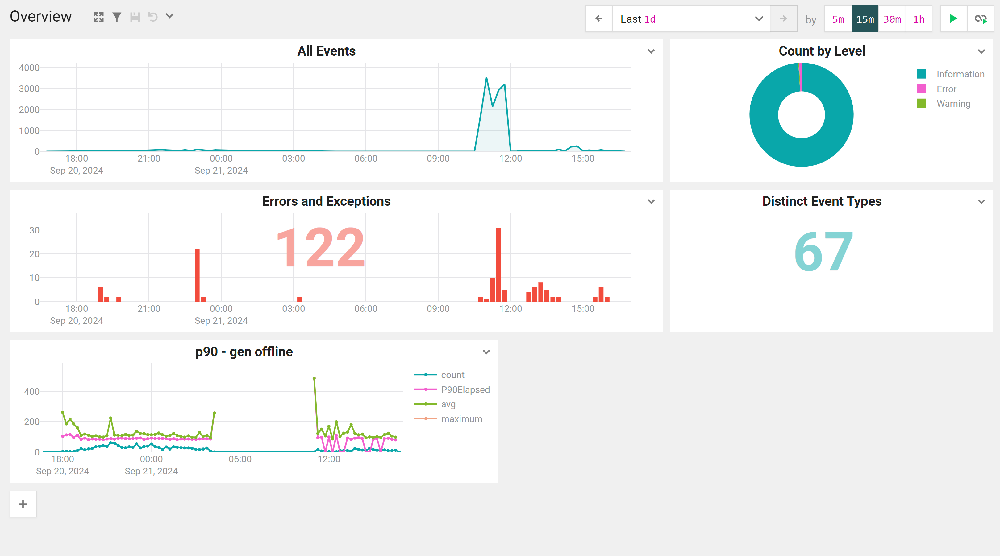
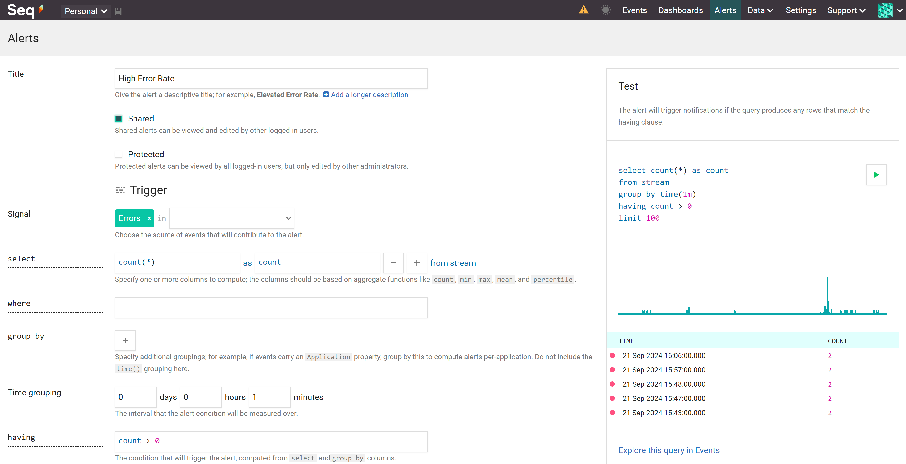
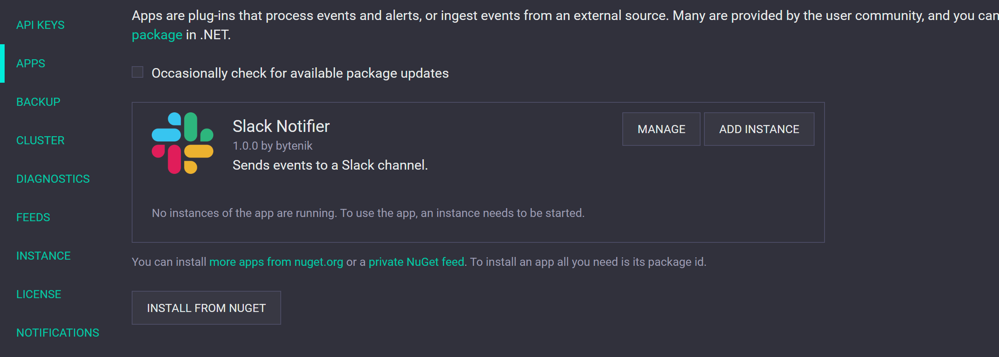
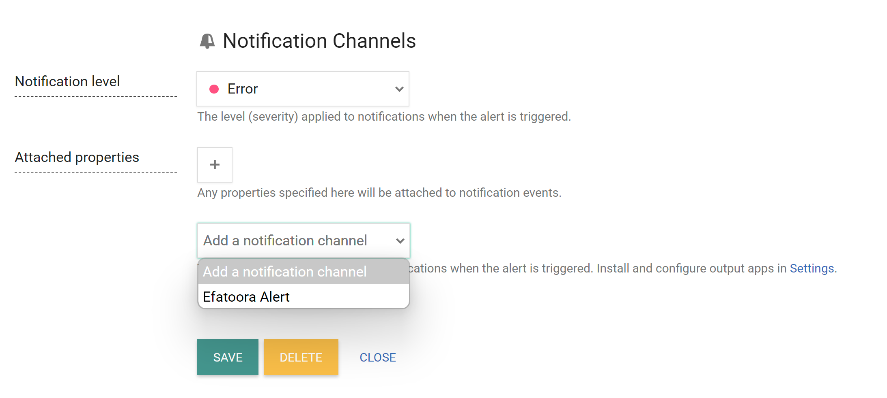
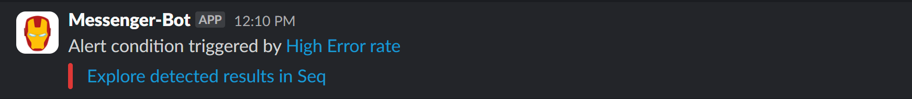

As your applications scale, monitoring becomes a critical aspect of maintaining their health. Developers despise manual monitoring and logging into dashboards to hunt for anomalies.

Let's build a monitoring and alerting system using open-source tools.

There are countless monitoring tools available, but we're going to use Seq because it's simple, freemium, and can be easily run using Docker to start collecting logs and events. Plus, it adheres to OpenTelemetry (OTel) standards, making it compatible with any platform.

Imagine we have an e-commerce application. We need to monitor and alert when the overall error rate spikes and keep an eye on user visits, a key metric for our business.

Let's dive in and install Seq using Docker.

```bash
docker run \
  --name seq \
  -d \
  --restart unless-stopped \
  -e ACCEPT_EULA=Y \
  -e SEQ_FIRSTRUN_ADMINPASSWORDHASH="$PH" \
  -v <local path to store data>:/data \
  -p 5341:80 \
  datalust/seq
```
<br/>

This should start Seq on port 5341. You can access the dashboard at `http://localhost:5341`. If you run into any issues, refer to the official [documentation](https://docs.datalust.co/docs/getting-started-with-docker).

Seq offers SDKs for most platforms and adheres to OpenTelemetry (OTel) standards, so you can use any OTel SDK to send logs to Seq. Check out this [link](https://docs.datalust.co/v4/docs/using-serilog) for integrating Seq as a Serilog sink, with examples for nearly all platforms.

Once your logs are flowing in, you can create alerts on the Seq dashboard based on any log pattern or metric. By default, Seq provides a dashboard displaying essentials like error rates, log counts, and event counts. You can also create custom dashboards to suit your needs.


<br/>

Let's be honest, dashboards are great, but what we really need are alerts that keep us informed without constant monitoring.

To create an alert, head over to the `Alerts` tab and click the `Add Alert` button.

Give your alert a meaningful name, choose the signal that should trigger it, and craft your query. You can even execute the query to ensure it triggers the alert as expected.


<br/>

I crafted this query to trigger an alert when the error count exceeds 50 within a 30-minute window. This way, we can catch issues before they escalate.

```sql
select count(*) as count
from stream
group by time(30m)
having count > 50
limit 100
```
<br/>

Now that we've set up an alert, it's time to create a notification channel. I prefer notifications to be delivered to the app our team uses the most, like Slack, Teams, or even Telegram.

For this example, we'll use Slack. You can create a Slack app and use a webhook to send notifications. Check out this [blog](../create-slack-bot) for a step-by-step guide on creating a Slack bot.

Once you have the webhook, let's install the Slack app in Seq. Head over to settings in Seq, click on `Apps`, then hit the `INSTALL FROM NUGET` button. Enter `Seq.App.Slack` as the package ID and click install. You should now see the Slack app listed in the apps tab.


<br/>

Now, let's wire up the webhook in the app. Click on the `ADD INSTANCE` button on the installed Slack app, provide the webhook URL, and hit save. No need to worry about other details—they'll be automatically inferred from the webhook.

With the Slack app set up, head back to the alert, navigate to the `Notifications` section, set the level to `Error`, select the Slack app we just installed, and click save.


<br/>

Voilà! Now, whenever the alert is triggered, you'll receive a Slack notification, keeping you in the loop without having to constantly check the dashboard.


<br/>

Similarly, you can count the number of events logged when a user visits your site and create an alert for that. Trust me, these kinds of alerts can save your business from losing money. Customers won't complain—they'll simply leave.

But remember, don't create too many alerts that generate noise. Focus on key metrics that truly impact your business.

Happy Monitoring!

If you enjoyed this blog, show some love by leaving a comment below and sharing it with someone who might find it useful.


