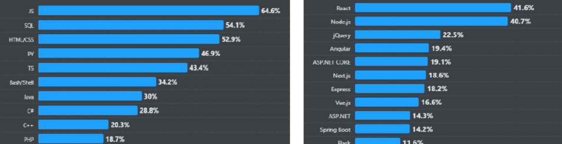
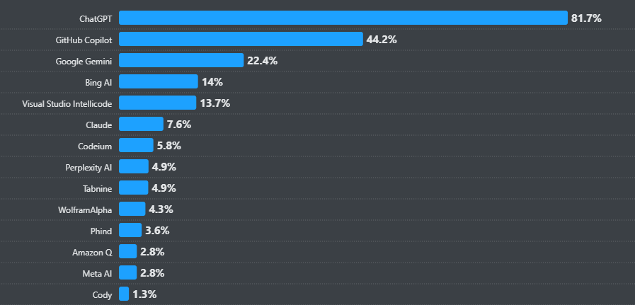

[Stack Overflow Developer Survey 2024](https://survey.stackoverflow.co/2024/) is out! Last year's survey provided insights into how developers around the world are embracing AI in their development processes. Let's find out what this year's survey has in store.

All views expressed here are opinionated and based solely on my experience.

### Web Development Scene

> JavaScript remains the most popular language this year.
> Python is the first language of choice for learners.

JavaScript is the language of the web, and it's here to stay. If you are a newbie developer, consider learning at least one JavaScript framework. According to the survey, **React.js** is still the number one preferred framework among professional developers worldwide. **Node.js** remains the preferred JavaScript runtime/JavaScript backend, but there is a significant shift towards **Next.js**.

At last year's Agoda Dev Day, there was a quiz question: which is older, Python or Java? Most developers jumped on Java, thinking it's the ancient beast we all know, but in reality, Python is older than Java 🐍. Sorry, Java! Once again, Python finds its way into many university curriculums, and with abundant learning content on YouTube, it's no wonder Python is the number one language for learners.

---

> Docker remains the most used tool among developers.

Learning Docker is crucial for any developer. I have experienced both worlds where deployment happens with MSI installers or sometimes ZIP files deployed through Octopus Deploy, but I would choose Docker for development any day. Containers play a key role in my development experience, from test containers to production environments. Since Docker is no longer free, we use Docker in WSL for Windows and OrbStack for Mac development.

#### What's the Scene on Databases?

> PostgreSQL debuted in the developer survey in 2018 when 33% of developers reported using it, compared with the most popular option that year: MySQL, in use by 59% of developers. Six years later, PostgreSQL is used by 49% of developers and is the most popular database for the second year in a row.

My colleague at Agoda was showing some performance results between SQL Server and PostgreSQL for some of our use cases. The results are stunning, though it's early to comment on the final outcome. My experience with PostgreSQL has been positive. At the very least, you save a ton of money on licensing 🤣, and performance is an added advantage.

#### What About the Pay of Developers Using These Technologies?

JavaScript developers' salaries have gone down in the new survey. I see a problem here, With the advent of AI tools like Co-pilot, any back-end developer can comfortably code in the front end when you have a proper design system in place. Does this mean the need for pure front-end developers is decreasing? Yes, at least according to the survey.

> Full-stack, back-end, and front-end developers were the top three roles reported by developers for the last three years; however, front-end developers have decreased from 6.6% to 5.6% since last year.

This survey on developer pay should be taken with a pinch of salt. Most of the languages that attract high pay are niche and not widely used. According to the survey, even the poster boys Rust and Go have seen a decrease in salary 🤣.

---

I am concerned that Stack Overflow didn't include any survey questions on testing and deployment tools and strategies, which are highly important. Given the increased amount of code being written and deployed to production since the advent of AI tools, these topics are crucial. I hope they make it into the survey next time.

#### What's the Scene on AI Tools for Development?

> 76% of all respondents are using or are planning to use AI tools in their development process this year, an increase from last year (70%). Many more developers are currently using AI tools this year, too (62% vs. 44%).

One tool that deserves my love among the AI tools mentioned in the survey is **GitHub Co-pilot**. I can't stress enough how much development effort it saves for me.

GitHub provides a one-month free subscription to Co-pilot. Try it out. If you are an engineering leader and you are reading this, hands down, Co-pilot improves developer experience. Happy developers lead to a better product.

This is not a product advertisement 🤭. And no, Co-pilot is not an overhyped auto-completion tool.

---

Agoda is doing a ton of things using ChatGPT. I'll write a blog about it later, or I can share one if my colleagues write one.

> 70% of professional developers do not perceive AI as a threat to their job.

Finally, fellow developers are embracing AI and accepting the fact that it's a tool. Some inner peace ✌️

I'll repeat one more time, **embrace AI**.

#### Conclusion

The Stack Overflow Developer Survey 2024 provides valuable insights into the current state of the developer ecosystem. From the enduring popularity of JavaScript and the rise of Python as the first language of choice for learners, to the increasing use of Docker and the evolving role of AI tools like GitHub Co-pilot, this year's survey highlights several important trends. It's clear that AI is being embraced as a valuable asset, with 70% of professional developers not seeing it as a threat to their jobs.

However, the survey did not cover testing and deployment tools and strategies—an oversight that is particularly significant given the increased volume of code being pushed to production with the help of AI tools. Hopefully, this will be addressed in future surveys. For more insights on methodologies, communities, and work environments, check out the full survey here. In summary, the key takeaway is to embrace change and continue to evolve as a developer.
