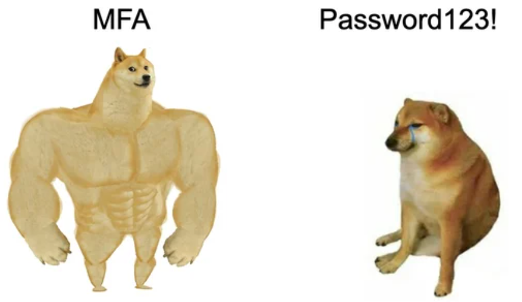
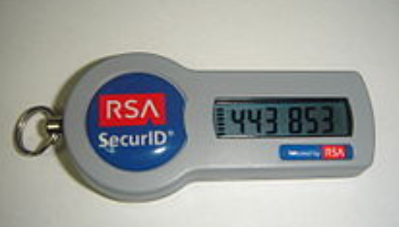
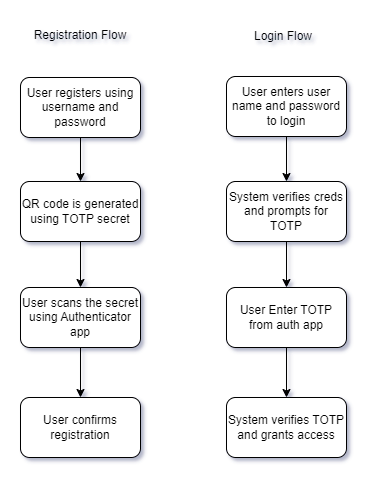
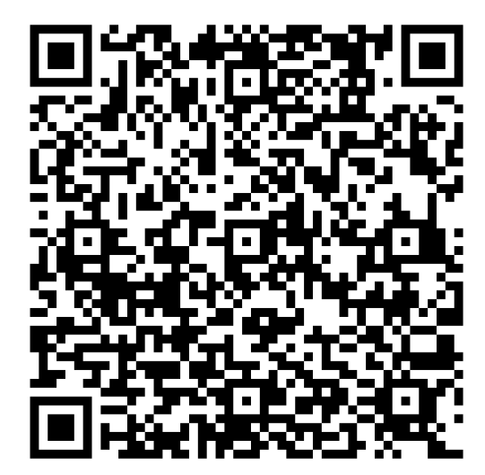
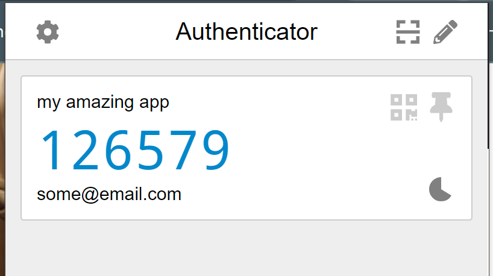

Basic Authentication (just username and password) has become increasingly insecure, as it can be easily compromised through phishing, brute force attacks, or data breaches. Let's face it: all systems have security flaws, but we should make it difficult for attackers.

So, what can we do? Well, we can do many things, but the easiest go-to answer is "Multi-Factor Authentication" (MFA).



<br />
Attention 🚨 - MFA is not a replacement for allowing users to create weak passwords.

There are multiple ways to enable MFA. Let's explore a few of them.

### Email Based OTP

An OTP will be delivered to the registered email. Accessibility is a pro here, as most users have an email account. However, you need to set up SMTP, store the OTP to validate it later, and be aware that emails can be compromised.

### Sms Based Otp

An OTP will be delivered to the registered mobile number. It's easy to use and poses a lesser security risk than email-based OTPs. But... there are high costs involved.

So, this leaves us to select a solution that should be cost-effective and easy to use.

### Introducing TOTP!!!

Time-Based One-Time Passwords (TOTP) are randomized numeric codes generated by authenticator apps like [Google Authenticator](https://play.google.com/store/apps/details?id=com.google.android.apps.authenticator2&hl=en) and [Microsoft Authenticator](https://play.google.com/store/apps/details?id=com.azure.authenticator&hl=en). These codes are generated based on a shared secret and a time counter, which means a new OTP is typically generated every 30 seconds. The OTP is valid only for the allotted time window, beyond which it becomes redundant, preventing OTP reuse.

#### Fun Fact!

The first TOTP authentication system was developed, patented, and marketed by RSA Security. Later, the Initiative for Open Authentication (OATH) developed its own variant of TOTP, which it made freely available. I hope many of you have seen the image below 😆



<br />
Let's see how we can implement one. I'm using C# here as an example, but it should
be pretty much the same across platforms.

Below is the basic user journey for registration and authentication:



<br />

```csharp
using OtpNet;
using QRCoder;
```

<br />
We are using [otp.net](https://github.com/kspearrin/Otp.NET?tab=readme-ov-file#totp-timed-one-time-password)
and [QRCode](https://github.com/codebude/QRCoder) here

```csharp
var secret = Base32Encoding.ToString(
                KeyGeneration.GenerateRandomKey(20)
                );
```

<br /> The secret is generated using `KeyGeneration.GenerateRandomKey`. I would
prefer one secret per user and store it securely after encrypting it using AES
or other popular algorithms.

```csharp var qrCode = GenerateQrCodeUri("some@email.com",secret);

string GenerateQrCodeUri(string email, string secret)
{
string issuer = "my amazing app";
string uri = $"otpauth://totp/{issuer}:{email}?secret={secret}&issuer={issuer}";

    using (var qrGenerator = new QRCodeGenerator())
    {
    	var qrCodeData = qrGenerator.CreateQrCode(uri, QRCodeGenerator.ECCLevel.Q);
    	var qrCode = new Base64QRCode(qrCodeData);
    	return qrCode.GetGraphic(20);
    }

}

```

<br /> With the help of QRCoder, we can generate a QR code. Below is the output
from the above code, which you can scan using authenticator apps.



<br />

Once you have scanned the QR code, it will appear in authenticator apps like the one below. Oh yeah, the screenshot below is taken from the Chrome Google Authenticator extension.



<br />

Now you have a time-based OTP. Let's see how to validate it.

```csharp
var secret = "my secure secret";

var code = "650260";

var isValid = ValidateTotpCode(secret,code);

isValid.Dump();

bool ValidateTotpCode(string secret, string code)
{
	var totp = new Totp(Base32Encoding.ToBytes(secret));
	return totp.VerifyTotp(code, out long timeStepMatched, new VerificationWindow(2, 2));
}
```

<br />

`totp.VerifyTotp` will help us validate whether the input TOTP is valid or not.

Tada!!! With these easy steps, you have enabled MFA for your application.

Having MFA will not protect against impersonating cookies or JWTs. We will see how to make your JWT more secure in upcoming posts.
