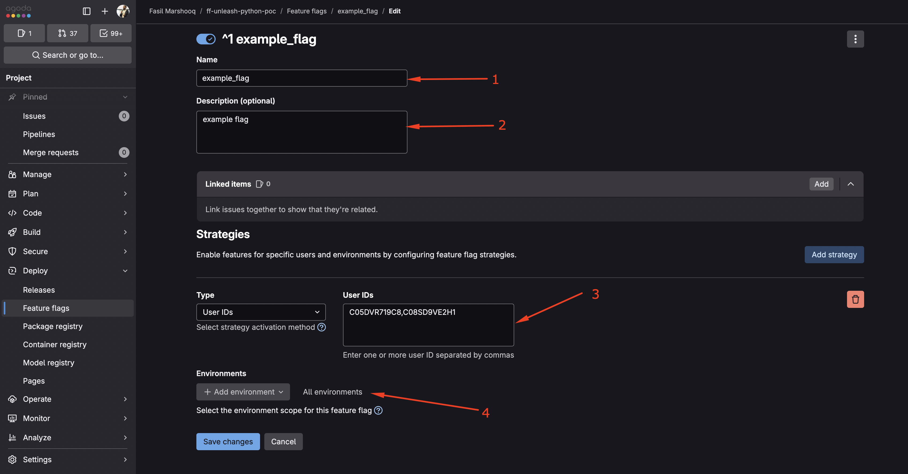

I’m on a team building an internal AI Slack bot. It evolves at lightning pace, which is great for shipping, not so great for stability. Even with tests, LLMs can be nondeterministic by design. We needed a way to dark‑launch features, flip them on and off safely, and watch real users (sorry, team) kick the tires in production.

The requirement was simple:

- Turn features on/off instantly, without redeploys.
- Target specific Slack channels for rollouts.
- Keep it lightweight.

At Agoda we take experimentation seriously - we even have an in‑house platform called Calculon. It’s powerful. It’s also overkill for this use case. As my lead engineer Niek said, “don’t kill a mosquito with a bazooka.”

Based on my mates suggestion, we tried [Unleash](https://github.com/Unleash) - a solid open‑source feature flag platform with SDKs for many languages. And here’s the nice twist - GitLab exposes an Unleash‑compatible API for feature flags. So we can use GitLab as the control plane and Unleash SDK in our app. Simple, cheap, effective.



In GitLab, feature flags live under the Deploy section. Their docs are here: [GitLab Feature Flags](https://docs.gitlab.com/operations/feature_flags/).

What you configure there:

1. A unique flag name : this is what the SDK checks in code.
2. A description : future you will thank you.
3. Strategies : for our use case, “User IDs” lets us target by identifiers. We use the Slack channel name or ID as `userId`.
4. Environments : scope flags to specific environments. If you leave it blank, it applies to all.

Now the code part. Unleash has SDKs for many languages; our bot is in Python. With GitLab SaaS, the Unleash endpoint looks like:

`https://gitlab.com/api/v4/feature_flags/unleash/<project-id>`

You also provide an app name and an instance ID (GitLab shows one on the Feature Flags page). The Python client sends the right headers automatically.

```python
from UnleashClient import UnleashClient

UNLEASH_URL: str = "https://gitlab.com/api/v4/feature_flags/unleash/<project-id>"
UNLEASH_APP_NAME: str = "production"
UNLEASH_INSTANCE_ID: str = "<your-instance-id>"
FEATURE_FLAG_NAME: str = "example_flag"

client = UnleashClient(
    url=UNLEASH_URL,
    app_name=UNLEASH_APP_NAME,
    instance_id=UNLEASH_INSTANCE_ID,
    refresh_interval=15,   # seconds; default ~15
    metrics_interval=60,   # seconds
)
client.initialize_client()

enabled: bool = client.is_enabled(
    FEATURE_FLAG_NAME,
    context={"userId": channel_name},  # target Slack channel
)
```

Yep, it’s that simple. The client runs a background scheduler thread that polls GitLab for changes (about every 15 seconds by default; configurable via `refresh_interval`). It won’t block your requests, but it does keep your toggles fresh.

If you’re still here, you’re probably wondering “okay but why should I care?”

1. Dark launches without redeploys - if something goes sideways, flip it off. Panic avoided.
2. A/B testing via variants - `client.get_variant(...)` lets you serve different experiences and measure.
3. Granular targeting - user‑level control, phased rollouts, and exclusions without changing code.

All this magic is Unleash SDK + GitLab. No GitLab? You can self‑host Unleash or use a hosted feature flag service. Either way, your future deploys will feel a lot less like tightrope walking.