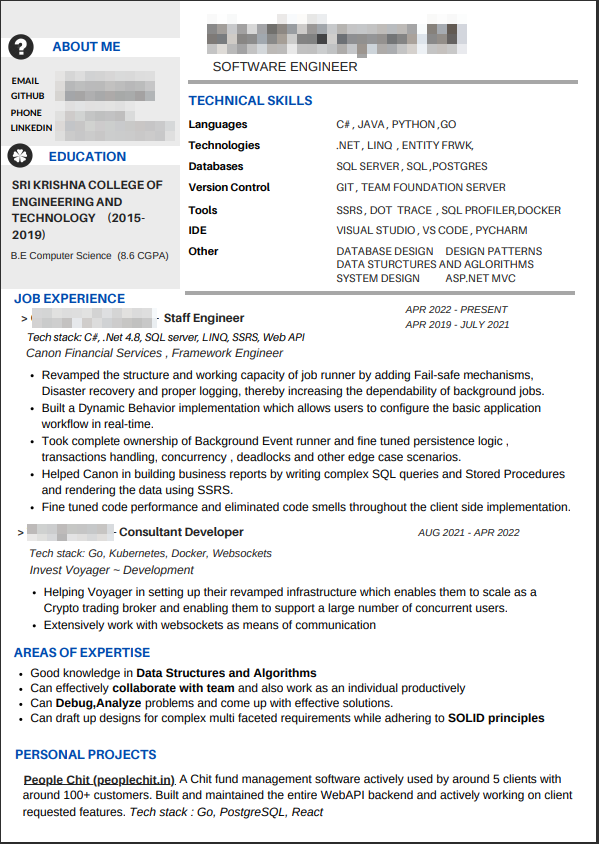

In today's competitive job market, it's not uncommon for a single job posting to receive thousands of applications. For example, Company A might receive around 2,000 applications for a single job post. Manually reviewing each resume is not feasible, so many companies turn to AI-powered CV screening tools like Greenhouse to streamline the process.

These tools use algorithms to scan and evaluate resumes based on predefined criteria, ensuring that only the most relevant candidates make it through to the next stage. However, many resumes are not structured or written in a way that these AI tools can effectively parse and evaluate. This can result in qualified candidates being overlooked simply because their resumes don't meet the machine's criteria.

Let's take a closer look at how these tools work and what you can do to optimize your resume for AI screening.

Lets consider this resume, This is from my former collegue. All PII data redacted for obvious reasons.
He is a fantastic back end engineer, one of the best i have worked with, will he be part of my dream team ofcourse yes!!

---

---
  
But machines dont understand relationship dynamics, let see how it reads.

Consider the following automated review for a Senior Software Engineer position at Company A:

---

Automated Review for Application ID *******, Job Pool [BE] Senior Software Engineer

Feature evaluation:

- Total working years -
  5 years, Reason: Total working experience 5.25 years (including 2.25 years at ******* 0.75 years at *******, 2.25 years at *******)

- Total years in last job -
  2 years, Reason: Years in last job: 2.25 years at *******

- Has any mentioned achievements, awards or recognitions -
  Requirement Passed: False, Reason: Matches: | AdditionalInfo: The CV does not mention any of the listed achievements, awards, or recognitions.

> This guy hasn't mentioned any of his achievements in the CV.

- Has a job title tagged as back-end -
  Requirement Passed: True, Reason: Found specified tag: IsBackendExperience in one of the job titles is true

- Has been promoted? -
  Requirement Passed: False, Reason: The CV does not indicate that the candidate has been promoted within the same company.

> Although he was promoted, the previous titles, roles and responsibilty is not mentioned in the cv.

- Has a job title tagged as big data or distributed system -
  Requirement Passed: True, Reason: Found specified tag: isBigDataOrDistributedSystemExperience in one of the job titles is true

> This is important your resume should have key words from JD

- Has completed any programming competitions -
  Requirement Passed: False, Reason: The CV does not mention any programming competitions.

> Similar to achievements , these are also crucial but could be added advantage

- Has experience leading a team or project -
  Requirement Passed: False, Reason: The CV does not provide any specific examples of the candidate leading a team or a project.

- Has mentorship experience -
  Requirement Passed: False, Reason: The CV does not provide any specific examples of the candidate mentoring or leading junior engineers.

- Has lead, principal or manager job titles on CV -
  Requirement Passed: False, Reason: The candidate does not have any job titles such as 'lead engineer', 'tech lead', 'lead developer', 'principal', 'engineering manager', or 'development manager' for more than 1 year.

- Is currently working at company of interest -
  Requirement Passed: False

CV summary:

The candidate has a Bachelor's degree in Computer Science from Sri Krishna College of Engineering and Technology with a CGPA of 8.6. They have over 5 years of experience in software engineering, with roles at Odessa Technologies, Thoughtworks, and Invest Voyager. The candidate has expertise in C#, .NET, SQL Server, LINQ, SSRS

The candidate has expertise in C#, .NET, SQL Server, LINQ, SSRS, Go, Kubernetes, Docker, and Websockets.

---

#### Understanding the Automated Review Process
The automated review process evaluates various features of the resume to determine if the candidate meets the job requirements. Here are some key points from the example review:

- Total Working Years: The tool checks the total years of experience and breaks it down by each job.
- Achievements and Awards: The tool looks for mentions of achievements, awards, or recognitions.
- Job Titles and Tags: The tool checks for specific job titles and tags related to the job requirements, such as back-end, big data, or distributed systems experience.
- Promotions: The tool looks for evidence of promotions within the same company.
- Programming Competitions: The tool checks for mentions of participation in programming competitions.
- Leadership and Mentorship: The tool looks for examples of leading teams or projects and mentoring junior engineers.
- Technical Papers: The tool checks for mentions of published technical papers.
- Language and Visa Requirements: The tool verifies if the CV is in English and if the candidate meets visa requirements.

#### Optimizing Your Resume for AI Screening Tools
To ensure your resume is effectively parsed and evaluated by AI screening tools, consider the following tips:

- Use Clear and Consistent Formatting: Ensure your resume is well-structured with clear headings and consistent formatting. Avoid using complex layouts or graphics that may confuse the parsing algorithms.

- Include Relevant Keywords: Use keywords and phrases that match the job description. For example, if the job requires experience in "big data" or "distributed systems," make sure these terms are prominently featured in your resume.

- Highlight Achievements and Awards: Clearly mention any achievements, awards, or recognitions. Use bullet points to list these accomplishments and make them easy to find.

- Detail Your Job Titles and Responsibilities: Provide detailed job titles and descriptions of your responsibilities. Use tags or keywords that match the job requirements, such as "back-end," "full-stack," or "data engineering."

- Showcase Leadership and Mentorship: If you have experience leading teams or mentoring junior engineers, make sure to highlight these experiences. Provide specific examples and use relevant keywords.

- Mention Technical Papers and Competitions: If you have published technical papers or participated in programming competitions, include these details in your resume.

- Ensure Language and Visa Compliance: Make sure your resume is written in English and clearly states your visa status if applicable.

#### Conclusion
In today's job market, your resume is often the first point of contact with potential employers, and it's increasingly likely that it will be read by machines before it reaches human eyes. AI-powered CV screening tools like Greenhouse are used by many companies to efficiently process large volumes of applications. To ensure your resume stands out and makes it through the initial screening, it's essential to optimize it for these tools.

By using clear formatting, including relevant keywords, highlighting achievements, and providing detailed job descriptions, you can improve your chances of passing the automated review and getting noticed by hiring managers. Remember, your resume is a reflection of your professional experience and skills, so take the time to craft it carefully and make sure it effectively communicates your qualifications.
